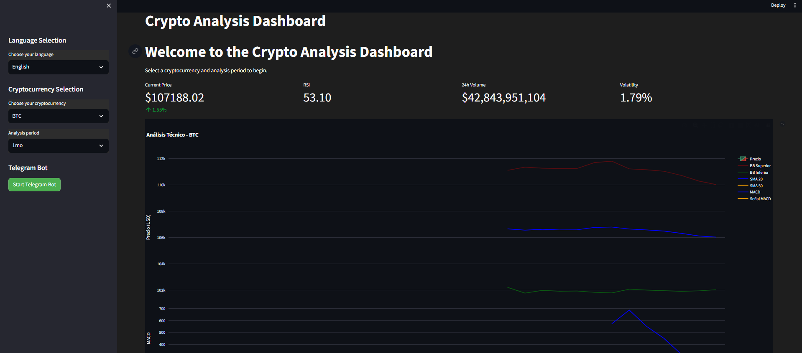
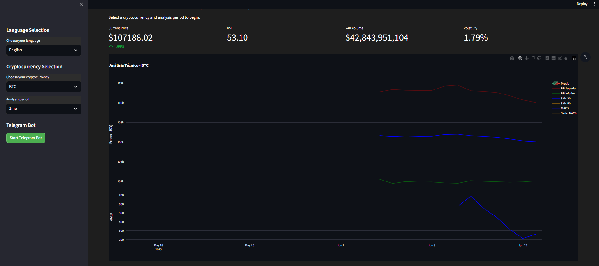
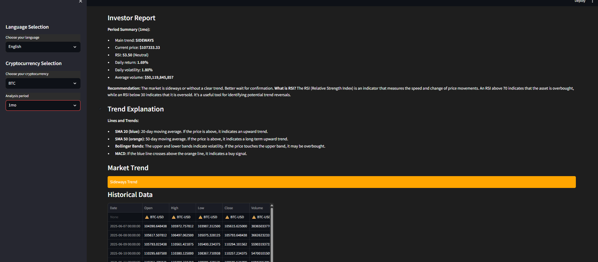
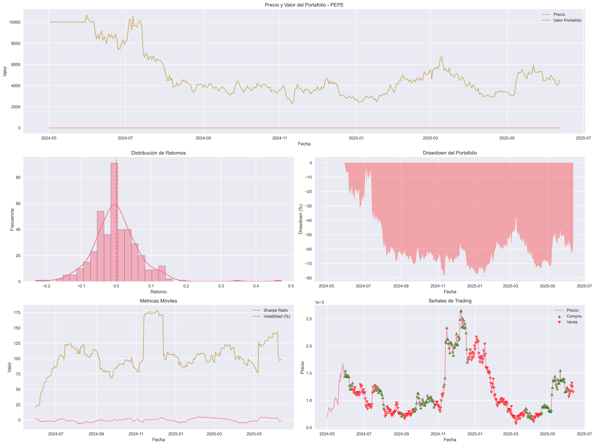
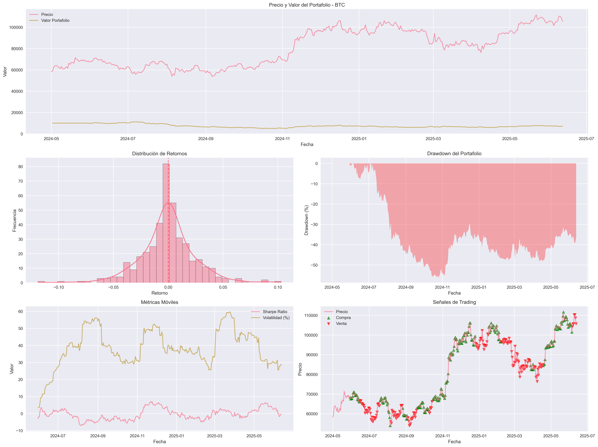
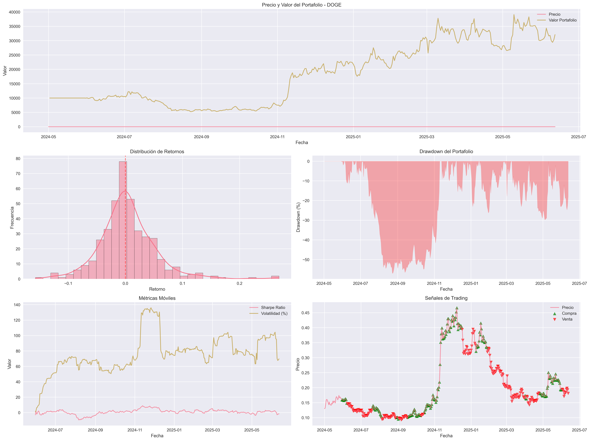

# Crypto Analysis Dashboard

A professional system for cryptocurrency market analysis and algorithmic trading strategies, featuring a modern web interface for real-time market insights and historical performance analysis. This project combines advanced data processing, machine learning, and real-time monitoring to provide comprehensive cryptocurrency market analysis.

## 🌟 Key Features

### Real-time Market Analysis
- Interactive dashboard with real-time cryptocurrency data
- Technical indicators visualization (RSI, MACD, Bollinger Bands)
- Multi-language support (English/Spanish)
- Customizable time periods for analysis
- Market trend identification and recommendations

### Advanced Data Processing
- ETL pipeline for efficient data processing
- Real-time data extraction from multiple sources
- Advanced data transformation and feature engineering
- Efficient data loading and storage
- Historical data analysis and backtesting

### Trading Strategy Implementation
- Moving Average Crossover strategy
- Backtesting system with performance metrics
- Risk analysis and performance evaluation
- Advanced metrics calculation (Sharpe, Sortino, VaR, etc.)
- Strategy optimization and parameter tuning

### Monitoring and Alerts
- Real-time market monitoring
- Customizable price alerts
- Trend change notifications
- Volume spike detection
- Performance tracking and reporting

### Telegram Bot Integration
Our Telegram bot provides real-time market insights and automated trading signals. Here's what you can do with it:

1. **Market Analysis**
   - Get real-time price updates
   - Receive technical analysis reports
   - View trend predictions
   - Monitor volume and volatility

2. **Trading Signals**
   - Automated buy/sell signals
   - Price alerts
   - Trend change notifications
   - Volume spike alerts

3. **Custom Commands**
   ```
   /start - Initialize the bot
   /help - Show available commands
   /analyze <symbol> - Get technical analysis
   /list - Show available cryptocurrencies
   /alert <symbol> - Set price alerts
   /trend <symbol> - Get trend analysis
   /volume <symbol> - Check volume analysis
   ```


*Telegram bot interface showing real-time market analysis and commands*

### Supported Cryptocurrencies
- Bitcoin (BTC)
- Ethereum (ETH)
- Binance Coin (BNB)
- Stellar (XLM)
- Ripple (XRP)
- Dogecoin (DOGE)

## 🖥️ Dashboard Preview


*Main dashboard interface showing real-time market data and technical analysis*


*Detailed technical analysis with multiple indicators*


*Market trend analysis and recommendations*


*Multi-language support with English and Spanish interfaces*


*Cryptocurrency selection interface with real-time price updates*

## 🚀 Features

*   **Interactive Dashboard**: Real-time cryptocurrency price tracking and interactive charts.
*   **Technical Analysis**: Integration of key indicators like RSI, MACD, and Bollinger Bands.
*   **Dynamic Investor Reports**: Generate period-specific reports with trend analysis and recommendations.
*   **Multi-language Support**: Seamless switching between English and Spanish interfaces.
*   **Telegram Bot Integration**: Real-time alerts and market data queries via Telegram.

## 📸 Screenshots

Aquí tienes una vista general de las funcionalidades del dashboard a través de capturas de pantalla:

### Dashboard Principal
Esta imagen muestra la interfaz principal del dashboard, incluyendo la selección de idioma y criptomoneda, junto con las métricas clave del mercado en tiempo real.


### Gráfico de Análisis Técnico
Visualiza el análisis técnico detallado con indicadores como SMA 20, SMA 50, Bandas de Bollinger y MACD, esenciales para entender las tendencias del mercado.


### Informe del Inversor y Datos Históricos
Una vista combinada del informe dinámico para el inversor, que ofrece un resumen del período, recomendaciones y una explicación de la tendencia del mercado, junto con la tabla de datos históricos.


## 🛠️ Technical Architecture

### System Components
1. **Data Processing Layer**
   - ETL pipeline for data extraction and transformation
   - Real-time data processing
   - Historical data management
   - Feature engineering

2. **Analysis Layer**
   - Technical analysis engine
   - Strategy implementation
   - Backtesting system
   - Performance metrics calculation

3. **Presentation Layer**
   - Streamlit web interface
   - Telegram bot integration
   - Real-time alerts system
   - Data visualization

4. **Monitoring Layer**
   - Prometheus metrics
   - Performance monitoring
   - System health checks
   - Alert management

### Technology Stack
- **Backend**: Python 3.8+
- **Web Framework**: Streamlit
- **Data Processing**: Pandas, NumPy
- **Machine Learning**: Scikit-learn
- **Visualization**: Plotly
- **Monitoring**: Prometheus
- **Containerization**: Docker
- **Orchestration**: Docker Compose
- **Workflow Management**: Apache Airflow

## 📋 Requirements

- Python 3.8+
- Dependencies listed in `requirements.txt`
- Streamlit for web interface
- YFinance for market data
- python-telegram-bot for Telegram integration
- Docker and Docker Compose (optional)
- Prometheus (optional)

## 🚀 Installation

1. Clone the repository:
```bash
git clone https://github.com/RanuK12/crypto-analysis-dashboard.git
cd crypto-analysis-dashboard
```

2. Install dependencies:
```bash
pip install -r requirements.txt
```

3. Configure Telegram Bot:
   - Create a new bot using [@BotFather](https://t.me/botfather)
   - Get your bot token
   - Add the token to your environment variables or `.env` file:
     ```
     TELEGRAM_BOT_TOKEN=your_bot_token_here
     ```

4. Run the dashboard:
```bash
python -m streamlit run main.py
```

5. Start the Telegram bot (in a separate terminal):
```bash
python telegram_bot.py
```

### Docker Installation (Optional)
```bash
docker-compose up -d
```

## 💻 Usage

### Dashboard Interface

The dashboard provides several key features:

1. **Language Selection**: Choose between English and Spanish interfaces
2. **Cryptocurrency Selection**: Select from supported cryptocurrencies
3. **Time Period Selection**: Choose analysis period (1d to 1y)
4. **Technical Indicators**:
   - RSI (Relative Strength Index)
   - MACD (Moving Average Convergence Divergence)
   - Bollinger Bands
   - Moving Averages (20 and 50 periods)

### Telegram Bot Usage

1. **Start the Bot**
   - Send `/start` to initialize the bot
   - Use `/help` to see available commands

2. **Market Analysis**
   - Use `/analyze BTC` to get technical analysis for Bitcoin
   - Get trend analysis with `/trend ETH`
   - Check volume analysis with `/volume BNB`

3. **Price Alerts**
   - Set price alerts with `/alert BTC 50000`
   - Get notified when price targets are reached
   - Receive trend change notifications

4. **Real-time Updates**
   - Get instant market updates
   - Receive trading signals
   - Monitor portfolio performance

## 📊 Analysis Examples

### Example Analysis

Here's an example of the analysis output for Bitcoin:

```
Trading Analysis - BTC
==================================================

1. Overall Performance:
   - Total Return: -27.87%
   - Annualized Return: -18.32%
   - Sharpe Ratio: -0.37
   - Sortino Ratio: -0.50

2. Trading Activity:
   - Number of Trades: 378
   - Success Rate: 49.21%
   - Profit Factor: 0.94
   - Average Gain/Loss Ratio: 0.97

3. Risk Analysis:
   - Annual Volatility: 39.22%
   - Maximum Drawdown: -55.93%
   - Calmar Ratio: -0.33
   - VaR (95%): -3.98%
   - Expected Shortfall (95%): -5.74%
```

### Backtesting Results

#### PEPE (2024-05-01 to 2025-06-13)


#### BTC (2024-05-01 to 2025-06-13)


#### DOGE (2024-05-01 to 2025-06-13)


## 📈 Trading Metrics Guide

### Performance Metrics
- **Total Return**: Overall percentage gain/loss
  - Positive: Strategy is profitable
  - Negative: Strategy is losing money
- **Annualized Return**: Yearly equivalent return
  - > 20%: Excellent
  - 10-20%: Good
  - < 10%: Poor
- **Sharpe Ratio**: Risk-adjusted returns
  - > 1: Good
  - > 2: Very Good
  - > 3: Excellent
- **Sortino Ratio**: Downside risk-adjusted returns
  - > 1: Good
  - > 2: Very Good
  - > 3: Excellent

### Trading Activity Metrics
- **Number of Trades**: Total executed trades
  - High: > 100 trades/month
  - Medium: 50-100 trades/month
  - Low: < 50 trades/month
- **Success Rate**: Percentage of profitable trades
  - > 50%: Good
  - > 60%: Very Good
  - > 70%: Excellent
- **Profit Factor**: Gross profit to gross loss ratio
  - > 1: Profitable
  - > 1.5: Good
  - > 2: Excellent
- **Average Gain/Loss Ratio**: Profit per winning trade vs loss per losing trade
  - > 1: Good
  - > 1.5: Very Good
  - > 2: Excellent

### Risk Metrics
- **Annual Volatility**: Standard deviation of returns
  - < 20%: Low risk
  - 20-40%: Medium risk
  - > 40%: High risk
- **Maximum Drawdown**: Largest peak-to-trough decline
  - < 20%: Low risk
  - 20-40%: Medium risk
  - > 40%: High risk
- **VaR (95%)**: Maximum expected loss with 95% confidence
  - < 5%: Low risk
  - 5-10%: Medium risk
  - > 10%: High risk
- **Expected Shortfall**: Average of losses beyond VaR
  - < 7%: Low risk
  - 7-15%: Medium risk
  - > 15%: High risk
- **Calmar Ratio**: Annualized return to maximum drawdown
  - > 1: Good
  - > 2: Very Good
  - > 3: Excellent

### Market Analysis Metrics
- **Volume Analysis**
  - Volume trend
  - Volume vs price correlation
  - Volume spikes detection
- **Trend Analysis**
  - Moving average crossovers
  - Support/resistance levels
  - Trend strength indicators
- **Momentum Indicators**
  - RSI overbought/oversold levels
  - MACD signal crossovers
  - Stochastic oscillator signals

## 🔧 Project Structure

```
├── main.py              # Main Streamlit application
├── telegram_bot.py      # Telegram bot implementation
├── src/
│   ├── data/
│   │   ├── __init__.py
│   │   └── exchange.py  # Market data handling
│   ├── strategies/
│   │   ├── base.py     # Base strategy class
│   │   └── moving_average.py
│   ├── backtest/
│   │   ├── runner.py   # Backtesting system
│   │   └── __main__.py
│   ├── analysis/
│   │   └── technical.py # Technical analysis
│   └── utils/
│       └── helpers.py   # Utility functions
├── notebooks/
│   └── analysis/       # Jupyter notebooks for analysis
├── docs/
│   └── images/         # Documentation images
├── tests/              # Test suite
├── monitoring/         # Monitoring configuration
│   └── prometheus/     # Prometheus setup
├── airflow/           # Airflow DAGs
│   └── dags/          # Workflow definitions
└── requirements.txt    # Project dependencies
```

## 🤝 Contributing

We welcome contributions! Here's how you can help:

1. Fork the repository
2. Create your feature branch (`git checkout -b feature/AmazingFeature`)
3. Commit your changes (`git commit -m 'Add some AmazingFeature'`)
4. Push to the branch (`git push origin feature/AmazingFeature`)
5. Open a Pull Request

### Development Guidelines
- Follow PEP 8 style guide
- Write unit tests for new features
- Update documentation as needed
- Use meaningful commit messages

## 📝 License

This project is licensed under the MIT License - see the [LICENSE](LICENSE) file for details.

## 📞 Contact

RanuK12 - [@RanuK12](https://github.com/RanuK12)

Project Link: [https://github.com/RanuK12/crypto-analysis-dashboard](https://github.com/RanuK12/crypto-analysis-dashboard)

## 🙏 Acknowledgments

- Yahoo Finance for market data
- Streamlit for the web framework
- Plotly for interactive visualizations
- Python-Telegram-Bot for bot integration
- All contributors and supporters of the project
