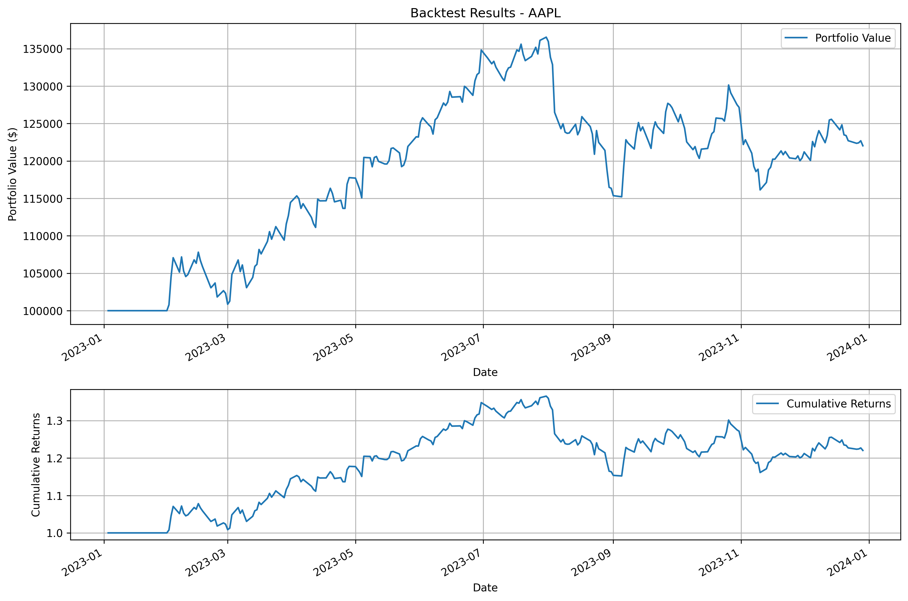
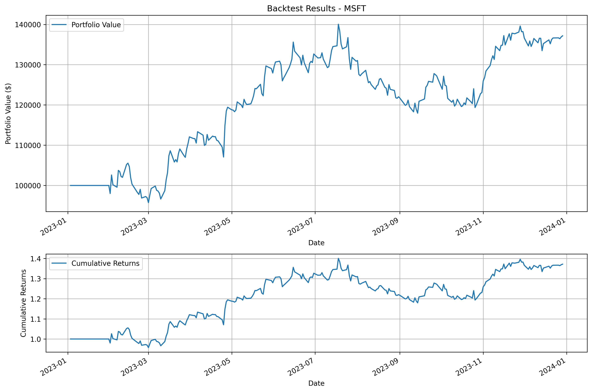
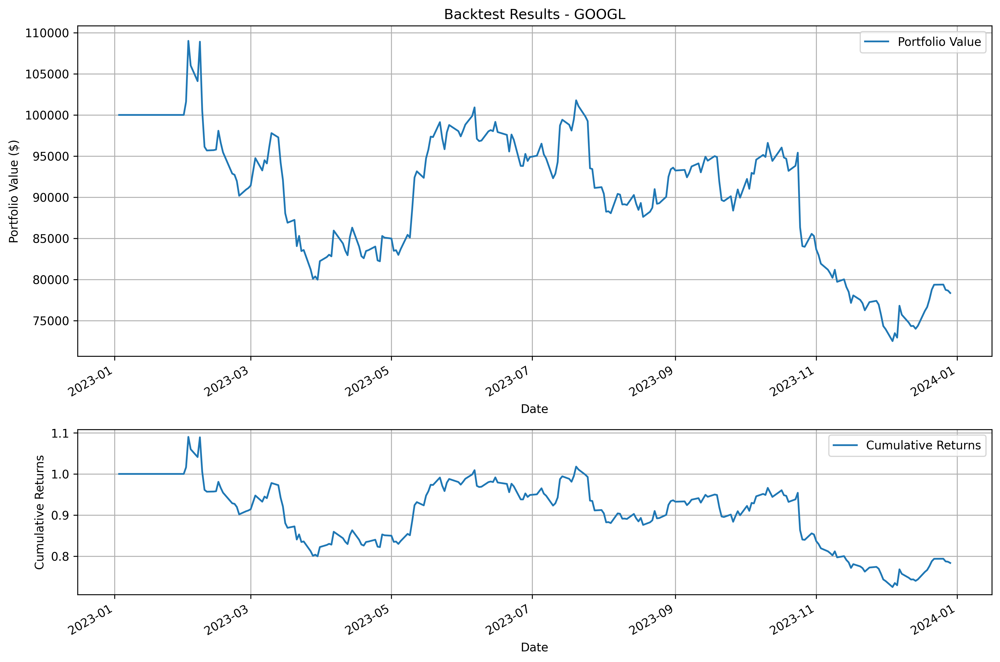

# Algorithmic Trading System

A system for backtesting algorithmic trading strategies.

## Features

- Historical stock data download using yfinance
- Trading strategy implementation (Moving Average Crossover)
- Backtesting system with performance metrics
- Results visualization

## Requirements

- Python 3.8+
- Dependencies listed in `requirements.txt`

## Installation

1. Clone the repository:
```bash
git clone https://github.com/RanuK12/cryptocurrency-price-monitor.git
cd cryptocurrency-price-monitor
```

2. Install dependencies:
```bash
pip install -r requirements.txt
```

## Usage

### Running Backtesting

To run a backtesting of a strategy:

```bash
python -m src.backtest --strategy MovingAverageCrossover --symbol AAPL --start-date 2023-01-01 --end-date 2023-12-31 --initial-capital 100000 --plot --save-plot
```

Parameters:
- `--strategy`: Strategy name to test
- `--symbol`: Stock symbol
- `--start-date`: Start date (YYYY-MM-DD)
- `--end-date`: End date (YYYY-MM-DD)
- `--initial-capital`: Initial capital for backtesting
- `--plot`: Show results plots
- `--save-plot`: Save results plots to file

### Results Examples

#### AAPL (2023)


```
Results for MovingAverageCrossover:
--------------------------------------------------
Period: 2023-01-01 to 2023-12-31
Initial Capital: $100,000.00
Final Capital: $122,034.39
Total Return: 22.03%
Annual Return: 22.23%
Sharpe Ratio: 1.15
Maximum Drawdown: -15.62%
```

#### MSFT (2023)


```
Results for MovingAverageCrossover:
--------------------------------------------------
Period: 2023-01-01 to 2023-12-31
Initial Capital: $100,000.00
Final Capital: $137,173.44
Total Return: 37.17%
Annual Return: 37.52%
Sharpe Ratio: 1.47
Maximum Drawdown: -15.77%
```

#### GOOGL (2023)


```
Results for MovingAverageCrossover:
--------------------------------------------------
Period: 2023-01-01 to 2023-12-31
Initial Capital: $100,000.00
Final Capital: $78,350.04
Total Return: -21.65%
Annual Return: -21.80%
Sharpe Ratio: -0.70
Maximum Drawdown: -33.48%
```

## Implemented Strategies

### Moving Average Crossover
- Buy when short SMA crosses above long SMA
- Sell when short SMA crosses below long SMA
- Default parameters:
  - Short SMA: 20 periods
  - Long SMA: 50 periods

## Project Structure

```
src/
├── data/
│   └── fetcher.py      # Historical data download
├── strategies/
│   ├── base.py         # Base strategy class
│   └── moving_average.py # Moving average crossover strategy
└── backtest/
    ├── runner.py       # Backtesting system
    └── __main__.py     # Main script
```

## Contributing

1. Fork the repository
2. Create your feature branch (`git checkout -b feature/AmazingFeature`)
3. Commit your changes (`git commit -m 'Add some AmazingFeature'`)
4. Push to the branch (`git push origin feature/AmazingFeature`)
5. Open a Pull Request

## License

This project is licensed under the MIT License - see the [LICENSE](LICENSE) file for details.

## Contact

RanuK12 - [@RanuK12](https://github.com/RanuK12)

Project Link: [https://github.com/RanuK12/cryptocurrency-price-monitor](https://github.com/RanuK12/cryptocurrency-price-monitor)