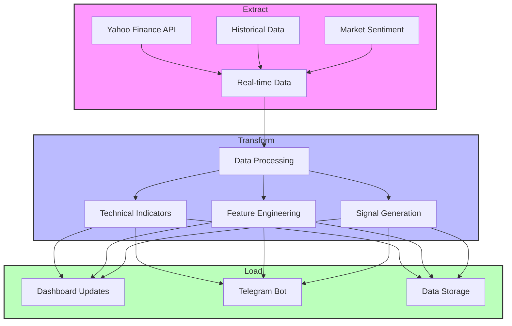

```mermaid
graph TD
    subgraph Extract
        A[Yahoo Finance API] --> B[Real-time Data]
        C[Historical Data] --> B
        D[Market Sentiment] --> B
    end

    subgraph Transform
        B --> E[Data Processing]
        E --> F[Technical Indicators]
        E --> G[Feature Engineering]
        E --> H[Signal Generation]
    end

    subgraph Load
        F --> I[Dashboard Updates]
        G --> I
        H --> I
        F --> J[Telegram Bot]
        G --> J
        H --> J
        F --> K[Data Storage]
        G --> K
        H --> K
    end

    style Extract fill:#f9f,stroke:#333,stroke-width:2px
    style Transform fill:#bbf,stroke:#333,stroke-width:2px
    style Load fill:#bfb,stroke:#333,stroke-width:2px
``` 